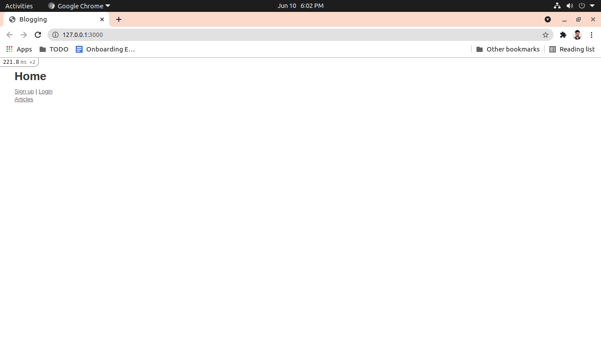
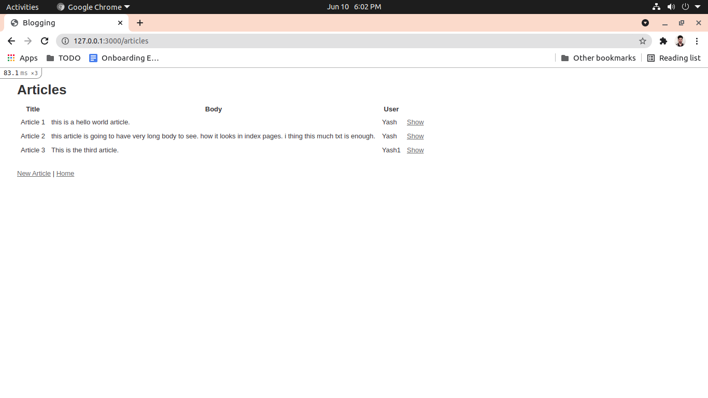
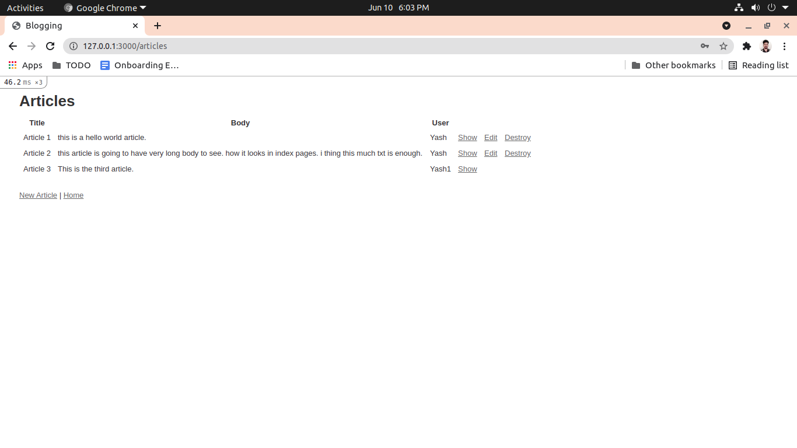
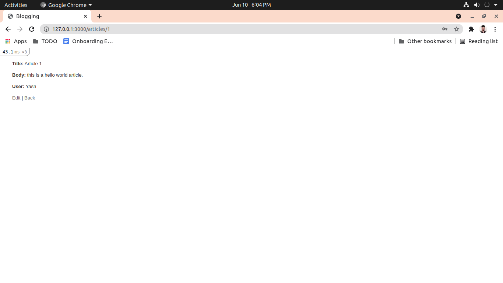

# README

<h1> Routes </h1>

<strong>home         => </strong> http://127.0.0.1:3000

<strong>signup       => </strong> http://127.0.0.1:3000/users/signup

<strong>login        => </strong> http://127.0.0.1:3000/users/login

<strong>article      => </strong> http://127.0.0.1:3000/articles

<strong>show article => </strong> http://127.0.0.1:3000/articles/:id

<strong>edit article => </strong> http://127.0.0.1:3000/articles/:id/edit

<strong>new article  => </strong> http://127.0.0.1:3000/articles/new

<strong>edit user    => </strong> http://127.0.0.1:3000/user/:id/edit

<h1> Screen shots </h1>

<strong>Home Page</strong>

<strong>Article Index : when no user signed in</strong>

<strong>Article Index : when user signed in</strong>

<strong>Article : when open</strong>

